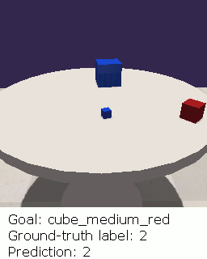

# Internally Rewarded Reinforcement Learning

#### This is an implementation for our ICML 2023 paper on internally rewarded reinforcement learning ([Project Website](https://ir-rl.github.io/)). 


    

  

## The digit recognition task
### Installation
```
conda env create --file=environment.yml
conda activate irrl
```

### Train a model
To train a model, run scripts in folder "./scripts/training/", e.g., 
```Shell
./scripts/training/ram_linear_clipping.sh
```
to train a RAM model using the clipped linear reward. 

### Test a ckeckpoint
We include a ckeckpoint ("./exps/ckpt_linear_clipping/ckpt/ram_18_4x4_1_ckpt_1400.pth.tar") obtained at the 1400 epoch during the training of a RAM model using the clipped linear reward for demonstration. To test the performance of the checkpoint, run 
```Shell
./scripts/testing/ram_linear_clipping_testing.sh
```
The average accuracy will be printed in the terminal, and folder containing meta data of 9 randomly generated cases will be created at "./exps/ckpt_linear_clipping/plots". 

### Visualize cases
During training, evalution, and testing, meta data of randomly sampled cases is saved in the corresponding experiment folder, e.g., "./exps/ckpt_linear_clipping/plots/ram_18_4x4_1" after running the previous testing example. To visulize the cases, run
```Shell
./scripts/draw_cases/draw_cases.sh
```
Figures and videos will be generated and saved in "./exps/ckpt_linear_clipping/plots/ram_18_4x4_1".

### Train a model with reward hacking 
We can train a model with the reward hacking trick. For example, to train a RAM model using the logarithmic reward function with reward hacking, run
```Shell
./scripts/reward_hacking_training/ram_reward_log_noclipping_hacking_training.sh
```
In this example, we use the reward produced by the checkpoint "./exps/ckpt_linear_clipping/ckptram_18_4x4_1_ckpt_1400.pth.tar" to replace the reward produced by the online training discriminator.

### Noise visualization
We can visualize the disctribution of reward noise. We provide a ckeckpoint ("./exps/ckpt_log_clipping/ckpt/ram_18_4x4_1_ckpt_600.pth.tar") of a RAM model trained using the logarithmic reward function at the 600 epoch for demonstration. Following previous examples, we use checkpoint "./exps/ckpt_linear_clipping/ckpt/ram_18_4x4_1_ckpt_1400.pth.tar" as the pretrained converged model. To get the reward noise, run
```Shell
./scripts/noise_visualization_testing/ram_log_clipping_noise_visualization_testing.sh
```
A file "./exps/ckpt_log_clipping/ckpt/noise_array_600.npy" containing reward noise of 1000 randomly selected cases of the testing dataset will be created. We can then use the jupyter notebook "./plots/noise_visualization/noise_visualizatin.ipynb" to visualize the distribution.

### Misc.
#### Generate the Cluttered MNIST dataset
We already include the Cluttered MNIST dataset used in the paper in "./data/ClutteredMNIST". To generate datasets with different configurations, edit parameters of "data/create_mnist_sequence.py" and run
```Shell
python data/create_mnist_sequence.py
```

## The skill discovery task
### Installation
Change the working directory to "skill_discovery":
```Shell
cd skill_discovery
```
In the conda virtual environment "irrl", we further install following packages:
```
./installation.sh
```
### Train a model
Run one of scripts in the "./scripts" folder to train the model using a specific reward function, e.g., using the clipped linear reward function:
```Shell
./scripts/train_linear_clipping.sh
```

### Plot state occupancies
When we set the "--plot_state_occupancies_freq" parameter to non-zero, data of state occupancies during the training process is saved. We can use jupyter notebook "./plots/plot_state_occupancies.ipynb" to plot state occupancies at different training stages. 

## The robotic object counting task
Will be open-sourced soon. 

## TODOs
- [ ] Share the simulation environment and code for the robotic object counting task.

## Acknowledgement
- Code of the digit recognition task is based on the open source implementation of [RAM](https://github.com/kevinzakka/recurrent-visual-attention). 
- Code of the unsupervised skill discovery task is based on the code of the [Colab implementation](https://colab.research.google.com/github/deepmind/disdain/blob/master/disdain.ipynb) of [DISDAIN](https://github.com/deepmind/disdain). 
- Code for generating the ClutteredMNIST dataset is based on code of [Recurrent Spatial Transformer Networks](https://github.com/skaae/recurrent-spatial-transformer-code).